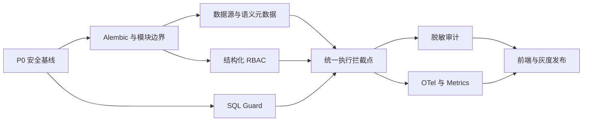

# DB-GPT 治理能力改造清单和关键动作

> 生成日期：2026-07-16
>
> 输入文档：`集成可行性.md`
>
> 改造目标：将云枢的元数据、数据源治理、`sqlparse`、细粒度 RBAC 和可观测性能力，以 DB-GPT 原生模块方式集成
>
> 排除范围：SQL Lab、通用 SQL 编辑器、AI SQL、Resource-as-API、Jinja SQL、产品目录扩建、行级 ABAC

## 1. 执行结论

本次改造应遵循“**先封安全入口，再建治理底座；先后端执行闭环，再做前端页面**”的顺序。

不能先复制云枢页面或建元数据表，再补权限。当前 DB-GPT 已存在以下生产阻断项：

- 用户、角色、部门管理接口缺少统一认证与管理员授权；
- Permission Serve 存在默认 JWT 密钥；
- Governance SQL Guard 仍是首 Token + 正则提表；
- Governance 表在应用启动时通过 `create(checkfirst=True)` 创建；
- 权限检查和限流在请求路径频繁查库，审计同步提交；
- 当前 Governance API Key 只有创建逻辑，没有完整认证入口。

因此，项目关键路径为：



## 2. 十个关键动作

### KA-01：冻结范围并形成 ADR

明确唯一身份源为 `sys_user/sys_role/sys_dept`，唯一数据源源头为 `connect_config`，唯一连接器入口为 `ConnectorManager`。SQL Lab、云枢 Portal Router、`api_users`、`sys_data_source`、云枢连接池和数据库 Adapter 不进入依赖闭包。

**产出**：集成边界 ADR、保留/迁移/重写/排除四类清单、模块负责人。

### KA-02：先关闭身份与权限入口漏洞

为 Permission Serve 除登录外的所有接口统一注入 Principal；用户、角色、部门写操作必须要求管理员或 `permission.manage`。生产配置检测到默认 JWT 密钥时直接拒绝启动。

**完成标志**：匿名访问返回 401，普通用户管理操作返回 403，生产默认密钥启动失败。

### KA-03：在完成认证链路前禁用半成品能力

Governance API Key 当前只能创建，不能认证；它不属于本次目标范围。默认关闭创建路由和入口。现有 `/governance/query` 在 SQL Guard 与统一 Authorizer 完成前通过 Feature Flag 关闭。

**完成标志**：默认部署不暴露不可完整验证的 API Key 和通用 SQL 查询入口。

### KA-04：先升级并加固 `sqlparse`

将 `dbgpt-core`、`dbgpt-serve` 的 `sqlparse==0.4.4` 统一升级为 `0.5.5`，处理 `SQLParseError`，限制 SQL 长度、Token 数、嵌套深度和解析时间。升级必须独立提交并通过现有 Connector 与 SQL 相关回归。

**完成标志**：依赖树只有一个版本；恶意嵌套、超长和多语句输入被可控拒绝。

### KA-05：用 Branch by Abstraction 拆分 GovernanceService

先定义 `MetadataRepository`、`Authorizer`、`SqlGuard`、`AuditWriter`、`GovernanceMetrics` 接口，由现有逻辑做旧适配器，再逐项替换，避免一次性重写 `governance/service.py`。

**完成标志**：HTTP 路由只依赖 Facade/Protocol，不直接访问其他 Serve 的内部 DAO。

### KA-06：所有结构变化进入 Alembic

新增治理实体必须通过 `pilot/meta_data/alembic/versions/` 管理。移除 Governance Serve 启动时自动建表职责，启动阶段只做版本/依赖就绪检查。

**完成标志**：空库升级、存量库升级、重复升级和回滚验证通过；启动过程不执行 DDL。

### KA-07：把授权落到实际 SQL 执行拦截点

建立 SQL 执行入口清册，覆盖 Governance API、Agent、Tool、数据库对话和内部服务。统一流程为 Principal → SQL Guard → Resource Set → Authorizer → Connector → Mask → Audit，不允许仅在前端或单一路由校验。

**完成标志**：入口清册中的每条路径都有自动化越权用例，未接入的入口默认关闭。

### KA-08：审计只记录白名单事件，不复制请求/响应体

审计事件只保存主体、动作、结构化资源、决策、状态、耗时、trace_id 和脱敏详情；SQL 保存指纹和可选脱敏模板，不保存连接凭据、Token、参数值和完整响应。

**完成标志**：敏感数据语料扫描为零；审计写入故障不阻塞普通读请求，关键授权变更仍保证落盘或明确失败。

### KA-09：复用 DB-GPT Tracer，补齐 Prometheus 指标

在授权、SQL 解析、连接获取、执行、脱敏、审计投递和画像任务处增加 OTel Span；新增允许/拒绝数、Guard 拒绝原因、数据源延迟、审计积压、画像任务等指标。

**完成标志**：可以用一个 trace_id 串起完整请求，并通过指标定位错误率、P95、拒绝率和积压。

### KA-10：分阶段灰度，保留快速回滚

所有新能力使用独立 Feature Flag；先 shadow 记录决策但不拦截，再对管理员/测试租户 enforce，最后全量。旧授权读取路径在迁移窗口内只读兼容，不进行双写。

**完成标志**：可在不回滚数据库的情况下关闭新扫描、画像、审计异步化和新 Authorizer；策略误判有审计证据可追溯。

## 3. 总体改造清单

状态约定：`[ ]` 未开始，`[-]` 进行中，`[x]` 完成，`[!]` 阻塞。

### 3.1 阶段 0：安全基线与范围冻结

| 状态 | ID | 优先级 | 改造项 | 主要改动位置 | 前置依赖 | 完成定义（DoD） |
| --- | --- | --- | --- | --- | --- | --- |
| [ ] | GOV-001 | P0 | 编写集成边界 ADR | `docs/` 或项目 ADR 目录 | 无 | 明确保留、重写、排除项；SQL Lab 依赖扫描为零 |
| [ ] | SEC-001 | P0 | 建立统一 Principal 依赖 | `permission/api/dependencies.py`（新）、`permission/api/endpoints.py` | GOV-001 | 除登录外全部要求合法 Token；禁用用户返回 401 |
| [ ] | SEC-002 | P0 | 保护用户/角色/部门管理接口 | `permission/api/endpoints.py:93-208` | SEC-001 | 匿名 401、非管理员 403、管理员成功；读写端点均有测试 |
| [ ] | SEC-003 | P0 | 移除生产默认 JWT 密钥 | `permission/config.py:19-25`、启动配置校验 | 无 | 生产使用默认/空密钥时拒绝启动；密钥不输出到日志 |
| [ ] | SEC-004 | P0 | 关闭未闭环 API Key | `governance/api/endpoints.py:146-148`、配置 | GOV-001 | 默认路由不可用或返回功能关闭；前端无入口 |
| [ ] | SEC-005 | P0 | 临时关闭通用 Governance Query | `governance/api/endpoints.py:89-91`、配置 | GOV-001 | SQL Guard/RBAC 未达标前 Feature Flag 默认关闭 |
| [ ] | DEP-001 | P0 | 统一升级 `sqlparse==0.5.5` | `packages/dbgpt-core/pyproject.toml:76`、`packages/dbgpt-serve/pyproject.toml:18`、锁文件 | 无 | 依赖解析无冲突，现有 SQL/Connector 测试通过 |
| [ ] | AUD-001 | P0 | 定义审计字段白名单与脱敏规则 | `governance/audit/`（新） | GOV-001 | 覆盖 password/token/secret/key/cookie/authorization/连接串/SQL 参数 |
| [ ] | TEST-001 | P0 | 建立安全发布阻断测试 | Permission/Governance tests | SEC-001～005 | 401/403、默认密钥、SQL 绕过、审计泄漏测试进入 CI |

### 3.2 阶段 1：架构骨架、迁移与数据源治理

| 状态 | ID | 优先级 | 改造项 | 主要改动位置 | 前置依赖 | 完成定义（DoD） |
| --- | --- | --- | --- | --- | --- | --- |
| [ ] | ARC-001 | P1 | 拆分治理领域接口 | `governance/metadata`、`policy`、`sql_guard`、`audit`、`observability` | GOV-001 | Protocol/Facade 边界确定，路由不直接访问内部 DAO |
| [ ] | MIG-001 | P1 | 建立治理 Alembic 基线 | `pilot/meta_data/alembic/versions/` | ARC-001 | 现有 7 张治理表被迁移体系识别，不丢存量数据 |
| [ ] | MIG-002 | P1 | 删除启动时自动建表 | `governance/serve.py:58-90` | MIG-001 | 应用启动不执行 `table.create`，版本不匹配时明确报错 |
| [ ] | DS-001 | P1 | 固化唯一数据源引用 | `governance/models.py`、Datasource Service Adapter | ARC-001 | 所有治理实体只引用 `connect_config.id`，无 `sys_data_source` |
| [ ] | DS-002 | P1 | 封装数据源治理 Adapter | `governance/metadata/datasource_adapter.py`（新） | DS-001 | CRUD/连接测试调用 DB-GPT DatasourceServe/ConnectorManager |
| [ ] | DS-003 | P1 | 定义连接器能力矩阵 | `governance/metadata/capabilities.py`（新） | DS-002 | 各数据库标注 schema、column、profile、readonly 能力；不支持时显式降级 |
| [ ] | DS-004 | P1 | 数据源删除/变更联动 | Datasource 事件或治理 Hook | DS-001 | 删除前检测治理引用；连接配置变更后失效缓存并触发元数据状态变更 |
| [ ] | ARC-002 | P1 | 冻结非目标功能 | Catalog、AccessRequest、API Key 相关路由/服务 | GOV-001 | 不扩建、不成为元数据/RBAC/可观测性依赖；有独立 Feature Flag |

### 3.3 阶段 2：语义元数据与画像

| 状态 | ID | 优先级 | 改造项 | 主要改动位置 | 前置依赖 | 完成定义（DoD） |
| --- | --- | --- | --- | --- | --- | --- |
| [ ] | META-001 | P1 | 新增语义元数据实体 | `governance/metadata/models.py`（新）、Alembic | MIG-001、DS-001 | dataset/table/column/metric/relationship 表、索引和唯一约束就绪 |
| [ ] | META-002 | P1 | 实现 Repository 与 Service | `governance/metadata/repository.py`、`service.py`（新） | META-001 | API 不出现云枢 `api_users/sys_resource_meta` 原生 SQL |
| [ ] | META-003 | P1 | 元数据采集与幂等刷新 | `governance/metadata/scanner.py`（新）、ConnectorManager | DS-002、META-002 | 重复扫描不重复建记录；支持全量、增量、失败重试和超时 |
| [ ] | META-004 | P1 | 迁移元数据健康度算法 | `governance/metadata/health.py`（新） | META-002 | 评分规则可配置、结果可解释，相同输入结果稳定 |
| [ ] | META-005 | P1 | 接入 DBSummaryClient | `datasource/service/db_summary_client.py` 的适配入口 | META-003 | 元数据刷新后可触发摘要增量更新，不建立第二套向量索引 |
| [ ] | META-006 | P1 | 新增元数据 API | `governance/api/metadata.py`（新） | META-002、RBAC-003 | 数据集/表/列/指标/关系 CRUD 和扫描状态均经过 Authorizer |
| [ ] | PROF-001 | P2 | 基础数据画像任务 | `governance/metadata/profile/`（新） | META-003、OBS-001 | 支持采样、超时、取消和并发限制；基础统计不依赖 LLM |
| [ ] | PROF-002 | P2 | 可选 AI 画像增强 | DB-GPT LLM/Agent Adapter | PROF-001 | Feature Flag 默认关闭；失败不影响基础画像；不引入云枢 AIService |

### 3.4 阶段 3：细粒度 RBAC 与 SQL Guard

| 状态 | ID | 优先级 | 改造项 | 主要改动位置 | 前置依赖 | 完成定义（DoD） |
| --- | --- | --- | --- | --- | --- | --- |
| [ ] | RBAC-001 | P1 | 定义结构化授权模型 | `governance/policy/models.py`（新）、Alembic | MIG-001 | subject_type/id、resource、action、effect、有效期和审计字段完整 |
| [ ] | RBAC-002 | P1 | 迁移 role_code 授权 | Migration + 兼容读取 Adapter | RBAC-001 | 旧 `governance_role_grant` 可重复迁移；冲突和非法 pattern 有报告 |
| [ ] | RBAC-003 | P0 | 实现统一 Authorizer | `governance/policy/authorizer.py`（新） | RBAC-001、SEC-001 | user/role/dept 聚合；deny 优先；缺资源/缺策略默认拒绝 |
| [ ] | RBAC-004 | P1 | 权限缓存与失效 | `governance/policy/cache.py`（新） | RBAC-003 | 版本化 Key；授权和成员变化后 5 秒内收敛；缓存故障回源不放行 |
| [ ] | RBAC-005 | P1 | 建立 SQL 执行入口清册 | `docs/governance-execution-points.md`（新） | GOV-001 | 覆盖 API、Agent、Tool、数据库对话和内部任务；标注 Owner 与接入状态 |
| [ ] | RBAC-006 | P0 | 接入所有执行拦截点 | 各执行入口 + Governance Facade | RBAC-003、SQL-002 | 清册中 100% 入口接入或关闭；每个入口有越权集成测试 |
| [ ] | SQL-001 | P0 | 实现新版 SQL Guard | `governance/sql_guard/`（新） | DEP-001、ARC-001 | 单语句、只读类型、资源提取、复杂度限制、未知输入默认拒绝 |
| [ ] | SQL-002 | P0 | 建立多方言 SQL 语料 | `governance/tests/sql_guard/`（新） | SQL-001 | 覆盖项目首批支持数据库、CTE/子查询/UNION/注释/别名/畸形输入 |
| [ ] | SQL-003 | P0 | 数据库侧只读兜底 | 数据源配置说明、连接测试 | DS-003、SQL-001 | 生产查询账号不具备 DDL/DML 权限；只读验证失败时不开放查询 |
| [ ] | MASK-001 | P1 | 统一列级允许与脱敏顺序 | `governance/policy`、`masking` | RBAC-003、SQL-001 | deny > allow > mask；禁止列不返回；最严格脱敏规则优先 |
| [ ] | RATE-001 | P1 | 替换审计表 COUNT 限流 | `governance/policy/rate_limit.py`（新） | ARC-001 | 使用 Redis/Valkey 或本地令牌桶；请求路径不扫描审计表 |

### 3.5 阶段 4：审计与可观测性

| 状态 | ID | 优先级 | 改造项 | 主要改动位置 | 前置依赖 | 完成定义（DoD） |
| --- | --- | --- | --- | --- | --- | --- |
| [ ] | AUD-002 | P1 | 新建结构化审计事件 | `governance/audit/models.py`（新）、Alembic | AUD-001、MIG-001 | 含 trace_id、actor、action、resource、decision、status、latency、event_date |
| [ ] | AUD-003 | P1 | 异步有界审计 Writer | `governance/audit/writer.py`（新） | AUD-002 | 批量写入、背压、重试、失败指标和优雅停机；普通查询不等待 DB commit |
| [ ] | AUD-004 | P1 | 审计查询、留存与归档 | `governance/audit/service.py`、任务 | AUD-003 | 按主体/资源/时间/决策查询；留存可配置；不在请求时建表 |
| [ ] | AUD-005 | P1 | 关键授权变更强审计 | Permission/Policy 管理入口 | AUD-003、RBAC-003 | grant/revoke/role membership/数据源变更必须有不可缺失的审计事件 |
| [ ] | OBS-001 | P1 | 增加治理 OTel Span | `governance/observability/tracing.py`（新） | ARC-001 | 一个 trace_id 串联 auth/guard/authorize/connect/execute/mask/audit |
| [ ] | OBS-002 | P1 | 增加 Prometheus 兼容指标 | `governance/observability/metrics.py`（新） | OBS-001 | 有请求量、延迟、允许/拒绝、错误、连接健康、审计积压、画像状态 |
| [ ] | OBS-003 | P1 | 分钟聚合与留存 Worker | `governance/observability/worker.py`（新） | AUD-003、OBS-002 | 多实例幂等；数据库租约或 Redis/Valkey 锁；可重放与补算 |
| [ ] | OBS-004 | P1 | 治理健康与就绪检查 | Governance Serve health | OBS-002、AUD-003 | 返回 DB、缓存、队列、Worker 状态；依赖失败不会误报 ready |

### 3.6 阶段 5：前端、迁移与发布

| 状态 | ID | 优先级 | 改造项 | 主要改动位置 | 前置依赖 | 完成定义（DoD） |
| --- | --- | --- | --- | --- | --- | --- |
| [ ] | UI-001 | P1 | 确定治理前端归属 | `web/`、`web/governance/` | META-006、RBAC-003 | 决定短期微前端或 React 原生；不复制云枢 Vue Portal |
| [ ] | UI-002 | P1 | 元数据与数据源治理页面 | 选定前端目录 | UI-001、META-006 | 数据源详情、元数据树、健康度、扫描/画像状态可操作 |
| [ ] | UI-003 | P1 | RBAC 与审计页面 | 选定前端目录 | UI-001、RBAC-003、AUD-004 | user/role/dept 授权、deny/allow、审计检索；按钮权限只是 UX，不替代后端 |
| [ ] | MIG-003 | P1 | 编写云枢数据迁移工具 | `scripts/governance_migration/`（新） | DS-001、META-001、RBAC-001 | dry-run、映射报告、冲突报告、幂等、断点续跑；不迁移认证凭据 |
| [ ] | MIG-004 | P1 | 历史审计选择性迁移 | 同上 | AUD-002 | 先脱敏、按保留期迁移；数量和校验和可核对 |
| [ ] | TEST-002 | P0 | 建立端到端安全矩阵 | Backend integration tests | RBAC-006、AUD-003 | JWT → Authorizer → Guard → Connector → Mask → Audit 全链路通过 |
| [ ] | TEST-003 | P1 | 多数据库契约与迁移测试 | CI、Connector fixtures | META-003、SQL-002、MIG-001 | 首批数据库采集和 Guard 一致；元数据库升级/回滚通过 |
| [ ] | PERF-001 | P1 | 性能与故障注入 | Load tests | RBAC-004、AUD-003、OBS-002 | 缓存命中治理 P95 增量目标 ≤5 ms；缓存/审计库故障行为符合设计 |
| [ ] | REL-001 | P1 | Feature Flag 与 Shadow 模式 | Governance config | 核心后端完成 | 扫描、画像、Authorizer enforce、异步审计、Query 路由可独立开关 |
| [ ] | REL-002 | P1 | 灰度与回滚演练 | 部署文档/Runbook | REL-001、TEST-002、PERF-001 | shadow → 测试主体 → 小流量 → 全量；每阶段有回滚门槛 |
| [ ] | CLEAN-001 | P2 | 移除兼容层和废弃表 | Governance 旧 Service/Entity | 稳定运行至少一个发布周期 | 无旧授权读路径、无运行时建表、无云枢重复表和死路由 |

## 4. 关键工作包

### WP-0：安全发布阻断包

包含 `SEC-001～005`、`DEP-001`、`AUD-001`、`TEST-001`。这是所有后续工作的前置包，建议独立 PR、独立发布，不与元数据功能混合。

验收重点：

- 路由枚举证明除登录外不存在匿名管理入口；
- 生产配置使用默认 JWT 密钥时启动失败；
- `/governance/query` 和 API Key 默认关闭；
- SQL 恶意输入不会导致进程高 CPU、递归异常或执行写操作；
- 日志、Trace、异常和审计中不出现密钥。

### WP-1：治理领域骨架包

包含 `ARC-001`、`MIG-001～002`、`DS-001～004`。采用 Branch by Abstraction：先让现有 GovernanceService 通过新接口运行，再迁移实现，不一次性改变所有 API 契约。

验收重点：

- Governance Serve 只负责装配和路由注册；
- DAO、Connector、PermissionServe 通过明确接口访问；
- Alembic 是唯一表结构变更入口；
- 任何设计不得引入第二套用户、数据源和连接池。

### WP-2：元数据闭环包

包含 `META-001～006`、`PROF-001`。先做物理和语义元数据、健康度、采集状态，再做画像；AI 增强放在可选子包。

验收重点：

- 数据源新增/修改/删除与元数据状态联动；
- 扫描任务幂等、有超时、有并发限制；
- 健康分可解释，元数据能增强 DBSummaryClient；
- 所有元数据读取均按资源授权过滤。

### WP-3：策略执行闭环包

包含 `RBAC-001～006`、`SQL-001～003`、`MASK-001`、`RATE-001`。这是核心业务包，必须以执行入口清册为验收依据。

授权决策固定顺序：

```text
验证 Principal
  -> 解析 SQL 和资源
  -> 检查显式 deny
  -> 聚合 user/role/dept allow
  -> 校验列级范围
  -> 执行只读查询
  -> 应用最严格脱敏
  -> 生成审计事件和指标
```

验收重点：

- 任意入口不能绕过 Authorizer；
- Redis/Valkey 不可用时回源数据库，不默认放行；
- SQL 解析失败、资源不明、策略不明均拒绝；
- 数据库账号本身只读，Guard 不是唯一防线。

### WP-4：审计与可观测性包

包含 `AUD-002～005`、`OBS-001～004`。审计、Trace、Metrics 分开建模，避免把所有请求内容都塞入日志表。

验收重点：

- 授权变更审计不可缺失；普通查询审计异步批量写；
- 队列积压、丢弃、重试和数据库错误均可观测；
- 多实例聚合不会重复计算；
- trace_id 可从 API 响应/日志关联到授权、执行和审计。

## 5. 推荐迭代与人员分工

| 迭代 | 建议周期 | 主要任务 | 建议 Owner | 退出条件 |
| --- | --- | --- | --- | --- |
| Sprint 0 | 1～2 周 | WP-0、安全 ADR、依赖升级 | Backend + Security | P0 安全测试通过 |
| Sprint 1 | 2 周 | WP-1、迁移基线、数据源 Adapter | Backend/Architecture | 无运行时 DDL、无重复主数据 |
| Sprint 2 | 2～3 周 | WP-2、元数据 API 和健康度 | Backend + Data | 采集幂等、权限过滤通过 |
| Sprint 3～4 | 3～4 周 | WP-3、统一 Authorizer/Guard | Backend + Security + QA | 执行入口覆盖 100% |
| Sprint 5 | 2 周 | WP-4、审计和 OTel/Metrics | Backend + SRE | Trace/指标/审计闭环 |
| Sprint 6 | 1～2 周 | 前端、迁移演练、灰度 | Frontend + QA + SRE | Go/No-Go 门槛全部满足 |

建议最小团队为 2 名后端、1 名前端、1 名 QA，并由 Security/SRE 兼职参与关键评审。单后端串行实施预计 9～14 人周。

## 6. 首批文件改动地图

### 必须修改

- `packages/dbgpt-serve/src/dbgpt_serve/permission/api/endpoints.py`
- `packages/dbgpt-serve/src/dbgpt_serve/permission/config.py`
- `packages/dbgpt-core/pyproject.toml`
- `packages/dbgpt-serve/pyproject.toml`
- `packages/dbgpt-serve/src/dbgpt_serve/governance/serve.py`
- `packages/dbgpt-serve/src/dbgpt_serve/governance/api/endpoints.py`
- `packages/dbgpt-serve/src/dbgpt_serve/governance/service.py`
- `packages/dbgpt-serve/src/dbgpt_serve/governance/models.py`
- `assets/schema/dbgpt.sql`
- `pilot/meta_data/alembic/versions/`

### 建议新增

```text
packages/dbgpt-serve/src/dbgpt_serve/governance/
  metadata/
  policy/
  sql_guard/
  audit/
  observability/
  api/metadata.py
  tests/sql_guard/
  tests/policy/
  tests/audit/
scripts/governance_migration/
docs/governance-execution-points.md
```

### 只复用、不复制

- `ConnectConfigEntity` 与 DatasourceServe；
- `ConnectorManager` 与现有数据库 Connector；
- Permission Serve 的 `sys_user/sys_role/sys_dept`；
- `DBSummaryClient`；
- DB-GPT Tracer/OpenTelemetry；
- 云枢的语义元数据字段设计、健康度算法、权限缓存思路和指标口径。

## 7. 数据迁移关键动作

1. 先导出云枢对象数量、唯一键、空值、重复值和外部引用，生成只读盘点报告。
2. 建立 `old_datasource_id/name -> connect_config.id`、`old_user_id -> sys_user.id`、`old_role_id -> sys_role.id` 映射表。
3. 用户只做身份映射，不迁移 API Key、密码 Hash 或 Token。
4. 将 `ds:name` 和 `ds:name:table:name` 权限码转换为结构化 Grant；无法解析的记录进入冲突报告，不默认扩大权限。
5. 先迁语义元数据，再迁画像结果；任务运行态不迁移。
6. 历史审计按保留期选择性迁移，迁移前执行字段白名单和脱敏。
7. 每批迁移支持 dry-run、幂等键、断点续跑、数量/校验和核对和逆向清理脚本。
8. 迁移期间旧库只读，DB-GPT 为唯一写入端，不做长期双写。

## 8. 测试与质量门槛

### 安全门槛

- [ ] 除登录外，Permission/Governance 路由匿名访问全部返回 401；
- [ ] 普通用户访问管理操作全部返回 403；
- [ ] 默认/空 JWT 密钥无法以生产模式启动；
- [ ] SQL 写操作、多语句、资源不明和复杂度超限全部拒绝；
- [ ] 数据库查询账号无 DDL/DML 权限；
- [ ] 审计、日志和 Trace 不包含密码、Token、Cookie、连接串和明文参数。

### 功能门槛

- [ ] 数据集、表、列、指标、关系 CRUD 与扫描闭环；
- [ ] 数据源变更能正确触发元数据过期/刷新；
- [ ] user/role/dept 授权、显式 deny、列级范围和脱敏顺序正确；
- [ ] 所有 SQL 执行入口经过同一 Authorizer 和 SQL Guard；
- [ ] 审计可通过 trace_id、主体、资源、时间和决策检索；
- [ ] SQL Lab 相关模块没有进入安装、启动、路由和前端依赖。

### 性能与稳定性门槛

- [ ] 权限缓存命中时治理校验 P95 增量目标不超过 5 ms；
- [ ] 审计库短时不可用不阻塞普通查询，积压有告警；
- [ ] 缓存不可用时回源数据库且不放宽权限；
- [ ] 多实例 Worker 不重复聚合；
- [ ] 元数据扫描和画像有超时、并发限制、取消和熔断；
- [ ] 空库/存量库升级、重复升级和回滚演练通过。

## 9. 发布 Go / No-Go

只有以下条件全部满足才允许开启新 Authorizer 的 enforce 模式：

1. `SEC-001～005`、`DEP-001`、`TEST-001` 全部完成；
2. SQL 执行入口清册覆盖率为 100%，未接入入口已关闭；
3. Alembic 升级和回滚演练通过，应用启动不执行治理 DDL；
4. 多方言 SQL Guard 语料和数据库侧只读验证通过；
5. 审计脱敏、背压和关键授权变更强审计通过；
6. Shadow 模式的允许/拒绝差异已评审，不存在大面积误拒绝；
7. SLO、告警、Runbook 和回滚开关可用；
8. SQL Lab、云枢认证、云枢数据源和连接池未进入发布包。

任一 P0 未完成均为 No-Go。

## 10. 明确不做

- 不挂载云枢独立 FastAPI 应用；
- 不迁移 `api_users`、密码、API Key 和 Token；
- 不创建第二张数据源主表或第二套连接池；
- 不复制云枢 MySQL 原生 SQL、按日运行时建表和 Portal Middleware；
- 不建设 SQL Lab、SQL 编辑器、AI SQL、导出和执行历史；
- 不扩建 Resource-as-API、Jinja SQL、开发者门户和产品目录；
- 不在首期实现任意表达式行级 ABAC；
- 不用前端按钮权限替代后端 Authorizer；
- 不把 `sqlparse` 当成数据库权限的唯一防线；
- 不进行长期双写或大爆炸式切换。

## 11. 一句话行动建议

**先用 1～2 周完成安全发布阻断包，再按“迁移骨架 → 元数据 → RBAC/SQL Guard → 审计可观测性 → 前端灰度”推进；在执行入口覆盖率、默认拒绝和审计脱敏未验收前，不开放治理查询能力。**
