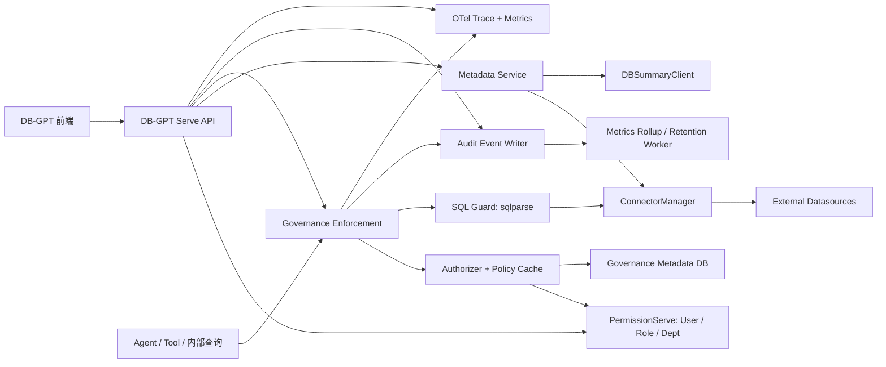

# 云枢能力集成 DB-GPT 可行性报告

> 调研日期：2026-07-16
>
> 调研范围：`yunshu/yunshu-api-data-platform` 与当前 DB-GPT 工作区
>
> 目标范围：元数据与数据源管理、`sqlparse`、细粒度 RBAC、可观测性
>
> 明确排除：SQL 实验室及其查询编辑、AI SQL、收藏、导出、执行历史等能力

## 1. 结论摘要

**结论：有条件可行，综合可行性约 8/10，建议推进。**

但推荐方式不是把云枢作为第二个 FastAPI 应用直接挂进 DB-GPT，也不是复制其数据库和连接池，而是：

1. 以当前 `dbgpt_serve.governance` 为集成入口；
2. 复用云枢的领域模型、权限聚合思路、元数据健康度算法和审计指标定义；
3. 使用 DB-GPT 原有的 `connect_config`、`ConnectorManager`、用户/角色/部门、Tracing 和数据库迁移体系重新实现；
4. SQL Lab 整体排除，只提取可被其他查询路径复用的 SQL 解析与安全校验能力。

这种方案可以避免双用户体系、双数据源表、双连接池、双认证链路和两套应用生命周期。两个项目同为 Python/FastAPI 技术栈且均使用 MIT License，代码层面不存在明显的技术或许可证阻断；如直接移植源码，仍应保留原项目版权和许可证声明。

当前 DB-GPT 已经存在一个治理模块雏形，但还不具备生产级安全性和完整性。因此建议把本次工作定义为“**治理模块原生化建设**”，而不是“云枢项目合并”。

## 2. 调研基线与系统上下文

### 2.1 项目基线

| 项目 | 调研基线 | 主要技术 | 现状判断 |
| --- | --- | --- | --- |
| DB-GPT | 当前工作树，基线提交 `98489d...` | FastAPI、SQLAlchemy、React/Next.js、Connector 体系、自有 Tracer/OTel | 已有数据源、用户角色部门、治理雏形和追踪底座 |
| 云枢 | `yunshu-api-data-platform`，提交 `8c2ab44...` | FastAPI、aiomysql、Redis、APScheduler、Vue 3、`sqlparse` | 目标功能较完整，但与其独立应用、MySQL 表和 SQL Lab 耦合较深 |

本报告基于当前工作树进行静态架构调研。未修改业务代码，也未执行截图测试。

### 2.2 系统边界

云枢当前是一个完整独立应用：在 `app/main.py:32-45` 初始化数据库、Redis 和调度器，在 `app/main.py:209-256` 注册中间件与路由。其门户路由同时包含认证、数据源、元数据、连接池、日志、监控和 SQL Lab（`app/api/portal/api.py:7-49`）。

DB-GPT 已经通过 Serve 体系注册数据源、权限和治理服务（`packages/dbgpt-app/src/dbgpt_app/initialization/serve_initialization.py:190-203`、`:355-384`）。因此，目标架构应保持一个 DB-GPT Web 应用和一个认证入口。

## 3. 现有能力盘点

### 3.1 云枢可提取能力

| 能力 | 云枢实现证据 | 可复用程度 | 处理建议 |
| --- | --- | --- | --- |
| 语义元数据 | `db-prod/V19-implement-semantic-metadata.sql:6-78` 定义数据集、表、列、指标和关系 | 高（模型设计） | 转成 DB-GPT SQLAlchemy Entity、DAO 和 Alembic 迁移 |
| 元数据健康度 | `app/services/meta_health_service.py:8-119`，按数据集/表/列/指标/关系计算健康分 | 高（纯领域算法） | 抽离 Repository 接口后迁移 |
| 数据画像 | `db-prod/V36-add-db-profile.sql:6-42`、`app/services/db_profile_service.py` | 中 | 保留异步画像任务；替换独立 AIService 和 SQL Lab 耦合 |
| 数据源管理 | `app/services/datasource_service.py`、`app/services/pool_manager.py` | 低（代码）/中（交互） | 不移植存储和连接池，复用 DB-GPT 数据源体系 |
| 权限聚合与缓存 | `app/services/permission_service.py:59-159` | 中高（思路） | 映射到 DB-GPT 用户/角色/部门，重写存储层和缓存失效 |
| 细粒度鉴权依赖 | `app/core/dependencies.py:141-243` | 中高 | 建成统一 Authorizer，供 API 和内部查询路径共同调用 |
| SQL 解析与只读防护 | `app/services/data_adapter/base.py`、`app/utils/sql_parser.py` | 中 | 使用升级后的 `sqlparse` 重构，不照搬各数据库 Adapter |
| 审计与分钟聚合 | `app/core/middleware.py:44-187`、`app/jobs/aggregator.py` | 中（指标定义） | 重写为脱敏事件、异步写入、可移植聚合任务 |
| 主机/Redis 监控 | `app/services/monitor_service.py:8-76` | 低到中 | 作为补充健康检查；核心改用 OTel + Prometheus 指标 |

### 3.2 DB-GPT 可直接复用的底座

1. **数据源主数据**：`ConnectConfigEntity` 已存储数据库类型、主机、账号、扩展配置等（`packages/dbgpt-serve/src/dbgpt_serve/datasource/manages/connect_config_db.py:28-55`）。
2. **连接器生态**：`ConnectorManager` 已支持多种数据库并提供连接器缓存（`packages/dbgpt-serve/src/dbgpt_serve/datasource/manages/connector_manager.py:40-109`），覆盖面高于云枢的自建连接池。
3. **身份体系**：DB-GPT 已有 `sys_user`、`sys_role`、`sys_dept` 及关联表（`packages/dbgpt-serve/src/dbgpt_serve/permission/models/models.py:20-112`）。
4. **治理入口**：`dbgpt_serve.governance` 已包含数据源策略、角色授权、脱敏、目录、API Key 和审计实体（`packages/dbgpt-serve/src/dbgpt_serve/governance/models.py:10-144`）。
5. **数据库摘要与向量化**：`DBSummaryClient` 已支持表/字段摘要、Embedding 和召回（`packages/dbgpt-serve/src/dbgpt_serve/datasource/service/db_summary_client.py:42-165`），新元数据应向它提供增强数据，而非另建索引链路。
6. **分布式追踪**：DB-GPT 已有 ContextVar Span、根 Tracer 和 OpenTelemetry Exporter（`packages/dbgpt-core/src/dbgpt/util/tracer/tracer_impl.py:28-204`、`packages/dbgpt-core/src/dbgpt/util/tracer/opentelemetry.py:22-47`）。

## 4. 推荐集成架构

### 4.1 核心原则

- **唯一身份源**：只使用 DB-GPT `sys_user/sys_role/sys_dept`。
- **唯一数据源源头**：只使用 `connect_config` 和 `ConnectorManager`。
- **领域能力移植，不做应用嵌套**：云枢的 FastAPI 生命周期、认证、Redis 初始化和 Portal Router 不进入 DB-GPT。
- **策略执行点统一**：API、Agent、工具调用和其他内部 SQL 路径都必须经过同一个 Authorizer 与 SQL Guard；仅在治理页面做校验没有安全意义。
- **审计与指标分离**：审计日志记录“谁在何时对什么做了什么、结果如何”；Prometheus/OTel 记录吞吐、延迟、错误率和链路。
- **默认拒绝**：无法可靠解析、资源无法定位、权限信息缺失时拒绝执行，而不是降级放行。

### 4.2 目标组件关系



### 4.3 推荐模块拆分

在现有 `packages/dbgpt-serve/src/dbgpt_serve/governance/` 下逐步拆分：

```text
governance/
  metadata/       # 数据集、表、列、指标、关系、健康度、画像任务
  policy/         # Subject/Resource/Action、授权、缓存与失效
  sql_guard/      # 语句拆分、只读判定、资源提取、方言约束
  audit/          # 脱敏审计事件、查询、留存
  observability/  # 指标、健康检查、分钟聚合
  api/            # 面向 DB-GPT Serve 的薄路由
```

现有 `governance/service.py` 已同时承担查询、授权、限流、脱敏和审计，职责偏重。继续把新能力塞进该文件会放大耦合，应按上述边界渐进拆分，保留一个 Facade 兼容现有 API。

## 5. 目标数据模型与迁移映射

### 5.1 建议新增或演进的实体

| 领域 | 建议实体 | 关键字段 |
| --- | --- | --- |
| 语义元数据 | `governance_dataset` | `datasource_id`、code、name、owner、tags、health_score |
| 语义元数据 | `governance_table` | dataset_id、schema_name、physical_name、description、health_status |
| 语义元数据 | `governance_column` | table_id、physical_name、data_type、semantic_type、description、sensitivity |
| 语义元数据 | `governance_metric` | dataset_id、code、formula、aggregation、unit |
| 语义元数据 | `governance_relationship` | source_table_id、target_table_id、relation_type、expression |
| 数据画像 | `governance_profile_task`、`governance_table_profile` | 状态、采样参数、统计结果、错误信息 |
| 细粒度权限 | `governance_grant` | subject_type、subject_id、datasource_id、schema/table/column pattern、action、effect |
| 审计 | `governance_audit_event` | event_date、trace_id、actor、action、resource、decision、status、latency、redacted_detail |
| 指标聚合 | `governance_metric_1m` | time_bucket、endpoint/action/resource dimension、count、error_count、latency sum/max |

`datasource_id`、`subject_id` 建议保存 DB-GPT 实体 ID，并由服务层校验引用。是否建立物理外键需结合 DB-GPT 各模块迁移顺序决定；不应按数据源名称或 `role_code` 建立松散关联。

### 5.2 云枢数据到 DB-GPT 的映射

| 云枢对象 | DB-GPT 目标 | 迁移策略 |
| --- | --- | --- |
| `sys_data_source` | `connect_config` | 不建重复表；按类型、主机、库名和名称去重导入，生成 ID 映射 |
| `api_users` | `sys_user` | 不复制认证凭证；按受控规则映射用户，冲突人工确认 |
| `sys_roles` / 用户角色关系 | `sys_role` / 现有关联表 | 合并角色并建立旧 ID 到新 ID 映射 |
| `sys_ui_permissions` 中数据权限 | `governance_grant` | 解析 `ds:*`、`ds:*:table:*` 编码，转换为结构化资源字段 |
| `meta_datasets/tables/columns/metrics/relationships` | 新语义元数据实体 | 保留业务字段，数据源名称引用转换为 `connect_config.id` |
| `db_profile_tasks/db_table_profiles` | 新画像实体 | 只迁移有效任务结果，不迁移 SQL Lab 增强信息 |
| 每日审计表 | `governance_audit_event` | 历史数据按保留期选择性导入，统一 `event_date`，先脱敏 |
| `api_access_stats_1m` | `governance_metric_1m` | 可选导入近期聚合数据；指标口径需先对齐 |

所有结构变更应使用 DB-GPT 的 Alembic 迁移；不采用当前治理 Serve 的运行时 `create(checkfirst=True)` 作为正式升级机制，也不采用云枢运行时 `CREATE TABLE ... LIKE` 的按日建表方式。

## 6. 分能力可行性判断

### 6.1 元数据与数据源管理：高可行

**推荐做法**：数据源 CRUD、连接测试和 Connector 实例全部留在 DB-GPT；为 `connect_config.id` 增加治理策略、语义元数据、画像和健康信息。

云枢的 `MetadataV2Service` 大量直接查询 `api_users`、`sys_resource_meta` 和 MySQL 表，不能原样搬迁。其数据集/表/列/指标/关系模型以及健康度评分可迁移到 Repository + Service 分层。

数据画像有两处需要解耦：

- `app/api/portal/endpoints/datasource.py:334-383` 通过 `LabEnhancementService` 提供画像搜索、标签和关联表；这些能力应迁入 Metadata/Profile Service，或者本期不做。
- `app/services/db_profile_service.py:924-966` 使用云枢独立的 AIService；应改用 DB-GPT 的 LLM/Agent 能力，并将 AI 增强设计为可选步骤，基础统计不能依赖 LLM 成功。

### 6.2 `sqlparse` 与 SQL Guard：高可行，但不能只升级依赖

云枢固定 `sqlparse==0.5.5`，DB-GPT 的 `dbgpt-core` 和 `dbgpt-serve` 当前固定 `0.4.4`。官方变更记录显示，0.5.0、0.5.3、0.5.4 和 0.5.5 连续增强了针对深层嵌套和算法复杂度型拒绝服务的防护，因此建议先统一升级至 0.5.5，并补齐异常处理和回归用例。[sqlparse 官方变更记录](https://sqlparse.readthedocs.io/en/stable/changes.html)

但 `sqlparse` 是非验证型解析器，不等于权限引擎。当前 `GovernanceQueryService._validate_read_only` 只检查首 Token，并用正则提取 `FROM/JOIN` 表（`packages/dbgpt-serve/src/dbgpt_serve/governance/service.py:95-109`）；底层 `connector.run()` 又具备执行 DDL/DML 的能力。生产实现至少需要：

1. 只允许单语句，正确处理注释、CTE、子查询、UNION、EXPLAIN 和方言关键字；
2. 对无法识别的 statement type、表或列默认拒绝；
3. 将资源提取结果交给 Authorizer，而不是用 SQL 前缀代替授权；
4. 使用数据库只读账号、只读事务或数据库侧权限作为最后防线；
5. 覆盖 MySQL、PostgreSQL、SQLite、ClickHouse、Oracle、SQL Server 的方言语料；
6. 捕获新版 `SQLParseError`，并限制 SQL 长度、Token 数量、嵌套深度和解析耗时。

SQL Lab 不纳入本期。建议把 SQL Guard 做成共享服务，只保护 DB-GPT 已有的必要查询入口；不新增通用 SQL 编辑器或匿名执行接口。现有 `/governance/query` 如需保留，应单独授权并按同一策略加固。

### 6.3 细粒度 RBAC：中高可行，需先补安全前置项

建议权限模型采用 `Subject + Resource + Action + Effect`：

- Subject：user、role、dept；
- Resource：datasource、schema、table、column、metadata_dataset；
- Action：view_metadata、query、profile、manage、grant、audit_read；
- Effect：allow/deny，显式 deny 优先；
- 范围：支持精确 ID 与受限 pattern；行级条件留作后续 ABAC，不在首期通过任意 SQL 字符串实现。

云枢权限服务能聚合直接授权和角色授权，并使用 Redis 缓存，这是值得复用的设计。但其资源以 `ds:name` 字符串编码，且依赖 `api_users` 等表；迁入后应改为结构化字段和 DB-GPT 用户、角色、部门 ID。

缓存建议使用版本化 Key：`governance:permissions:v1:{user_id}:{policy_version}`。授权、角色成员或部门关系变化时递增版本或精准失效；Redis/Valkey 不可用时回源数据库，不能默认放行。

### 6.4 审计与可观测性：中高可行，需重写存储路径

云枢已有 trace_id、请求耗时、审计记录、分钟聚合和主机/Redis 状态，但不适合直接搬迁：

- `AccessLogMiddleware` 会读取并保存请求体和 JSON 响应体（`app/core/middleware.py:92-170`），可能记录密码、Token、SQL 参数和敏感数据；
- 每日物理分表与 `CREATE TABLE ... LIKE`、跨日 `UNION ALL` 查询均偏 MySQL 专用；
- `psutil` 只反映单进程所在节点，不能代表多实例服务健康；
- 当前 DB-GPT 治理审计在请求路径同步提交数据库（`packages/dbgpt-serve/src/dbgpt_serve/governance/service.py:456-473`），会增加查询延迟并放大审计库故障影响。

推荐三条独立通道：

1. **Trace**：沿用 DB-GPT OTel Span，在认证、权限判断、SQL 解析、连接获取、执行、脱敏、审计投递处增加 Span/Attribute；禁止把原始 SQL 参数和敏感字段写入 Span。
2. **Metrics**：增加 Prometheus 兼容的 counter/histogram/gauge，例如授权允许/拒绝数、SQL Guard 拒绝原因、连接获取延迟、画像任务状态和审计队列积压。
3. **Audit**：写入结构化、脱敏后的 append-only 事件；通过有界队列异步批量写入，队列满时按照关键审计不丢失策略降级，并提供留存和归档任务。

分钟聚合任务可以复用 DB-GPT 的调度抽象，但应建立独立 Governance Worker，并使用数据库租约或 Redis/Valkey 锁保证多实例只执行一次。不要把它混入面向对话重放的 ScheduledTask 业务模型。

## 7. 明确不集成的 SQL Lab 边界

以下云枢内容不进入本次集成：

- `app/api/portal/api.py:43-45` 注册的 SQL Lab 路由；
- SQL 编辑、执行工作台、结果分页/导出、收藏、执行历史；
- AI SQL 生成、解释、修复、分析、对话；
- `LabEnhancementService` 及仅为 Lab 提供的标签/关联搜索接口；
- SQL Lab 专属表、前端页面、状态管理和定时任务；
- 云枢的通用 SQL Execution API 和独立数据库 Adapter 体系。

允许提取的仅是跨场景基础能力：SQL Token 化、只读判断、资源识别、风险提示、行数限制和审计事件生成。它们必须以无 UI、无独立执行入口的共享组件存在。

此外，云枢的 DaaS “Resource as API”、Jinja SQL 模板、开发者门户和产品目录不在用户指定范围内。本期不扩展这些能力；DB-GPT 当前已有的目录实体可以保留，但不应成为集成前置条件。

## 8. 风险清单

### P0：投产前必须解决

| 风险 | 证据与影响 | 建议 |
| --- | --- | --- |
| 权限管理接口缺少鉴权 | 当前 `/users`、`/roles`、`/depts` 的查询和写入路由未声明认证/管理员依赖（`permission/api/endpoints.py:93-208`），可能导致身份和角色被未授权修改 | 统一 Principal 依赖；除登录外默认认证；管理写操作要求 admin/permission.manage；补 401/403 测试 |
| 默认 JWT 密钥 | `permission/config.py:19-25` 包含默认 HS256 密钥；若生产沿用可伪造身份 | 生产环境检测默认值并拒绝启动；支持密钥轮换和 `kid` |
| SQL 只读校验可绕过或误判 | 当前首 Token + 正则不能可靠处理复杂 SQL，底层 Connector 可执行写操作 | 升级依赖、默认拒绝、方言测试、只读数据库凭据和数据库侧权限四层防护 |
| 敏感信息进入审计 | 云枢中间件直接捕获请求体、响应体和 source_sql | 不复制该实现；建立字段白名单、敏感键递归脱敏、SQL 指纹化和最大长度限制 |

### P1：首个生产版本应解决

| 风险 | 影响 | 建议 |
| --- | --- | --- |
| 双用户/双数据源/双连接池 | 数据不一致、权限绕过、运维成本翻倍 | 强制复用 DB-GPT 身份、`connect_config` 和 ConnectorManager |
| MySQL 专用 SQL 与按日建表 | DB-GPT 元数据库在 SQLite/PostgreSQL 等环境不可用 | SQLAlchemy + Alembic；使用日期列/原生分区/归档策略，不在请求时 DDL |
| 元数据与 SQL Lab 耦合 | 不引入 Lab 时画像搜索、标签关联调用断裂 | 抽到 Metadata/Profile Service，或明确延期 |
| 授权粒度不足 | 当前治理授权仅按 `role_code + datasource + table_pattern`，缺少 user/dept、列级和 deny | 使用结构化 grant，统一 Authorizer，所有执行入口复用 |
| 权限查询和限流性能 | 当前每次授权查库，限流通过审计表 `COUNT`（`governance/service.py:391-412`） | 权限缓存 + 版本失效；限流使用 Redis/Valkey 或内存令牌桶 |
| 运行时自动建表 | `governance/serve.py:58-80` 直接 `create(checkfirst=True)`，难以审计升级和回滚 | 全面迁至 Alembic，应用启动只做版本校验 |
| 审计同步提交 | 查询成功路径同步写审计库，影响延迟和可用性 | 有界队列、批量写入、失败指标和关键事件降级策略 |
| 多实例聚合重复执行 | 内存调度器在每个实例都会启动任务 | 数据库租约或 Redis/Valkey 分布式锁，任务幂等 |

### P2：可在稳定后优化

| 风险 | 影响 | 建议 |
| --- | --- | --- |
| 双前端技术栈 | 云枢 Vue 3 与 DB-GPT React/Next.js 会带来两套构建、路由和设计系统 | 原型期可保留当前治理微前端；稳定后迁到 DB-GPT 原生 React 页面 |
| 当前治理自动化测试较少 | 权限与 SQL 安全回归风险高 | 优先补策略矩阵、SQL 语料、迁移、审计脱敏和多数据库契约测试 |
| 画像任务可能阻塞 Web Worker | Connector 多为同步调用，库级扫描耗时长 | 线程池/任务队列执行，设置采样、超时、并发和熔断 |
| 列级权限与脱敏语义重叠 | 同一列可能同时命中 deny、allow 和 mask | 固定决策顺序：deny > allow；允许访问后再按最严格规则脱敏 |

## 9. 分阶段实施路径

### 阶段 0：安全基线与架构冻结（约 1～2 人周）

- 修复权限管理 API 鉴权和默认 JWT 密钥；
- 统一 `sqlparse==0.5.5`，完成多方言解析回归；
- 确认唯一身份源、唯一数据源源头和 SQL Lab 排除清单；
- 建立 Alembic 迁移骨架、治理模块目录边界和基础契约测试；
- 禁用或限制当前未形成完整认证链路的 Governance API Key 能力。

**退出条件**：未认证请求不能读写用户/角色/部门；默认密钥不能在生产启动；已知危险/复杂 SQL 语料默认拒绝。

### 阶段 1：数据源治理与语义元数据（约 2～3 人周）

- 将数据源治理属性绑定 `connect_config.id`；
- 新增数据集、表、列、指标、关系和健康度实体/DAO/API；
- 迁移元数据健康度算法；
- 使用 ConnectorManager 做元数据采集，增量刷新 DBSummaryClient；
- 增加画像任务基础统计，AI 增强可选。

**退出条件**：不创建 `sys_data_source` 副本；至少 MySQL/PostgreSQL/SQLite 完成采集契约测试；重复扫描幂等。

### 阶段 2：细粒度 RBAC、SQL Guard 与审计（约 3～4 人周）

- 落地 user/role/dept 到 datasource/schema/table/column/action 的授权模型；
- 建立统一 Authorizer、缓存和失效机制；
- 将 SQL Guard 接入所有必要的 DB-GPT SQL 执行点；
- 建立结构化脱敏审计事件和异步写入；
- 补权限矩阵、越权、SQL 绕过、缓存一致性和审计脱敏测试。

**退出条件**：默认拒绝生效；无权用户无法从 API、Agent 或内部工具绕过；审计中不出现密码、Token、连接串和明文敏感值。

### 阶段 3：可观测性、聚合与前端整合（约 3～5 人周）

- 增加 OTel Span 和 Prometheus 指标；
- 实现幂等分钟聚合、保留/归档和多实例 Leader Lock；
- 建设元数据、授权、审计和健康状态页面；
- 完成负载、故障注入和升级/回滚演练。

**退出条件**：能通过 trace_id 串联请求、授权、SQL Guard、数据源执行和审计；监控能识别拒绝率、错误率、P95 延迟、连接异常和审计积压。

按 1 名熟悉 DB-GPT 的后端工程师估算，完整范围约 **9～14 人周**；若由 2 名后端和 1 名前端并行，日历时间可压缩到约 6～8 周。该估算不包含大规模历史审计迁移、企业 SSO、行级 ABAC 和生产基础设施采购。

## 10. 测试与验收建议

本次调研不执行截图测试。后续实施建议至少覆盖：

- 单元测试：健康度算法、授权决策优先级、缓存失效、SQL Token/资源提取、审计脱敏；
- 属性/语料测试：嵌套 CTE、注释、Unicode、超长 SQL、多语句、方言、畸形输入和资源别名；
- 集成测试：JWT Principal → Authorizer → SQL Guard → Connector → Audit 全链路；
- 多数据库契约测试：MySQL、PostgreSQL、SQLite 为首批，其他连接器按支持矩阵逐步纳入；
- 迁移测试：空库升级、已有治理表升级、回滚、重复执行、云枢数据映射冲突；
- 性能测试：权限缓存命中率、审计队列背压、画像扫描并发、P95/P99 额外延迟；
- 安全测试：未认证管理接口、权限提升、SQL 绕过、Token/密码泄漏、越权元数据读取。

建议首期 SLO：治理校验在缓存命中时对普通请求增加的 P95 延迟不超过 5 ms；审计异步投递失败和队列积压必须有告警；权限缓存失效在 5 秒内收敛。最终数值应根据现有部署规模压测确认。

## 11. Go / No-Go 决策门槛

满足以下条件后建议 Go：

1. DB-GPT 权限管理端点完成认证和管理员授权；
2. 生产环境不允许默认 JWT 密钥；
3. 数据源、用户、角色均不建立云枢副本；
4. `sqlparse` 升级和多方言语料测试通过，无法解析时默认拒绝；
5. 所有新表通过 Alembic 管理，并验证 DB-GPT 支持的元数据库；
6. 审计字段白名单和脱敏测试通过；
7. SQL Lab 路由、服务、前端和数据库对象没有进入依赖闭包。

任一 P0 未解决时建议 No-Go，不应以“内网系统”作为放宽身份、SQL 或审计安全要求的依据。

## 12. 最终建议

**建议立项，但采用“DB-GPT 原生治理模块 + 云枢领域能力移植”的路线；先完成安全基线，再按元数据、RBAC/SQL Guard、可观测性三阶段交付，SQL Lab 全量排除。**
